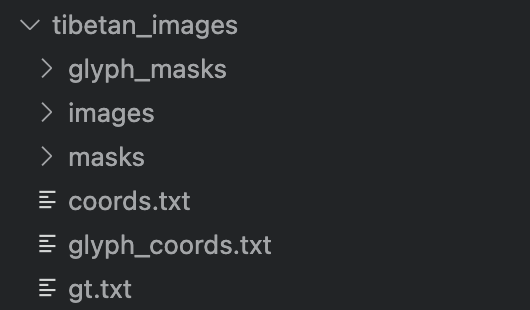

<div align="center">

# 多场景藏文OCR数据合成工具


</div>


## 🎯 项目简介

本项目是基于原版 SynthTIGER 定制的文本图像数据生成工具，专为藏文多场景 OCR（光学字符识别）任务设计。该版本针对藏文字符结构、书写规则及排版特性进行底层优化，集成多维度藏文资源与增强功能，支持高效生成贴合真实场景的训练数据，助力藏文文本识别模型的研发与优化。

<table rules="none" align="center" cellpadding="2" cellspacing="2">
  <!-- 第1行 -->
  <tr>
    <td></td>
    <td></td>
    <td></td>
    <td></td>
  </tr>
  <!-- 第2行 -->
  <tr>
    <td></td>
    <td></td>
    <td></td>
    <td></td>
  </tr>
  <!-- 第3行 -->
  <tr>
    <td></td>
    <td></td>
    <td></td>
    <td></td>
  </tr>
  <!-- 第4行 -->
  <tr>
    <td></td>
    <td></td>
    <td></td>
    <td></td>
  </tr>
  <tr>
    <td></td>
    <td></td>
    <td></td>
    <td></td>
  </tr>
  <tr>
    <td></td>
    <td></td>
    <td></td>
    <td></td>
  </tr>
</table>

## ✅ 核心功能
- 藏文专属优化配置：针对藏文字符结构、基线对齐等特性定制的参数资源，无需手动调整即可生成符合藏文 OCR 场景的数据。
- 80 种高质量藏文字体：覆盖传统印刷体（乌金体、乌梅体）、现代简体及手写风格，满足书籍、单据、笔记等多场景字体模拟需求。
- 多维度数据增强体系：基于预处理藏文语料库（新闻 / 文学 / 宗教等领域），支持自定义背景纹理、噪声干扰及旋转 / 透视变换等增强操作，提升数据泛化性。

## 🚀 快速开始

### 方法一：主程序启动（推荐）

```bash
# 基础命令 - 生成100张藏文图像
python -m synthtiger.main \
    examples/synthtiger/template.py \
    SynthTiger \
    config_tibetan_optimized.yaml \
    --progress \
    --count 100 \
    --output ./output
```

### 方法二：代码中直接调用

```bash
import synthtiger

# 加载配置
config = synthtiger.read_config('config_tibetan_optimized.yaml')

# 创建模板并生成数据（带进度条）
template = synthtiger.read_template(
    'examples/synthtiger/template.py', 
    'SynthTiger', 
    config
)

# 生成数据（带进度条）
generator = synthtiger.generator(
    'examples/synthtiger/template.py',
    'SynthTiger',
    config=config,
    count=100,
    progress=True,  # 启用进度条
    verbose=True
)

# 保存结果
template.init_save('./output')
for idx, (task_idx, data) in enumerate(generator):
    if data is not None:
        template.save('./output', data, task_idx)
template.end_save('./output')
```

## 📋 详细参数说明

### 主程序参数详解
| 参数 | 简写 | 说明 | 默认值 |
|------|------|------|--------|
| `--progress` | `-p` | 启用进度条显示 | False |
| `--count` | `-c` | 生成图像数量 | 100 |
| `--output` | `-o` | 输出目录路径 | None |
| `--worker` | `-w` | 工作进程数 | 0 |
| `--seed` | `-s` | 随机种子 | None |
| `--verbose` | `-v` | 显示详细错误信息 | False |

### 专用生成器参数详解
| 参数 | 说明 | 默认值 |
|------|------|--------|
| `--config` | 配置文件路径 | 必需 |
| `--count` | 生成图像数量 | 必需 |
| `--output` | 输出目录路径 | 必需 |
| `--script` | 模板脚本路径 | examples/synthtiger/template.py |
| `--template` | 模板类名称 | SynthTiger |
| `--verbose` | 显示详细输出 | False |
| `--seed` | 随机种子 | None |
| `--no-retry` | 失败时不重试 | False |

## 🎨 进度条效果展示

### 实时进度显示
```
🎨 生成进度: 60%|████████████████████████████████████▌| 60/100 [00:30<00:20, 2.00张/s]
```

## 📦 藏文资源配置详情

### 配置文件说明
- `config_tibetan_optimized.yaml`：藏文优化配置

### 字体资源详情
项目包含80种藏文字体，主要系列：
- **Himalaya 系列**：A, B, C, D, E, I, SN 等
- **Monlam Uni 系列**：OuChan1, OuChan2 等
- **Qomolangma 系列**：Art, Betsu, Chuyig, Drutsa 等多种风格

### 语料库说明
- `tib/tibetan_words.txt`：藏文词汇列表
- `tib/dict.txt`：藏文字符集

## 🔧 环境依赖安装

```bash
# 安装必需依赖
pip install tqdm pyyaml pillow numpy imgaug

# 可选依赖（提升体验）
pip install opencv-python
```

## 📝 使用注意事项

1. **进度条显示**：必须添加 `--progress` 参数才能看到进度条
2. **生成数量**：建议指定 `--count` 以获得准确的进度估算
3. **输出目录**：建议指定 `--output` 以保存生成结果
4. **错误信息**：使用 `--verbose` 可以查看详细的错误信息
5. **性能优化**：对于大量生成任务，可适当调整 `--worker` 参数

## 🎉 实用示例

### 基础示例
```bash
# 生成100张藏文图像，显示进度条
python -m synthtiger.main \
    examples/synthtiger/template.py \
    SynthTiger \
    config_tibetan_optimized.yaml \
    --progress \
    --count 100 \
    --output ./tibetan_images
```

### 高级示例
```bash
# 生成1000张藏文图像，使用4个工作进程，固定随机种子
python -m synthtiger.main \
    examples/synthtiger/template.py \
    SynthTiger \
    config_tibetan_optimized.yaml \
    --progress \
    --count 1000 \
    --worker 4 \
    --output ./tibetan_dataset \
    --verbose \
    --seed 2023
```


## 藏文文本预处理
测试语料

    བཤེར་དང་དུས་ངེས་མེད་ལ་ཟུར་བཤེར་བྱེད་པའི་ལམ་ལུགས་བསྟར་ནསཕྱོགས་མིའི་གཞི་རྩའི་གནས་ཚུལ་གསལ་པོར་ཤེས་རྟོགས་བྱེད་པ་དང་ཕྱོགས་མིའི་ཞབས་ཞུ་དང་དོ་དམ་ཆ་འཕྲིན་གྱི་དྲ་སྒོ་
    ཚང་དུ་གཏོང་བབོགས་གཏོང་ཁང་པའི་ཐོ་འགོད་རྩིས་ཁྲ་འཐུས་སྒོ་ཚང་དུ་གཏོང་བ་བཅས་བྱས་ཏེམི་སླེབས་འཕྲལ་ཐོ་འགོད་པ་དང་མི་འགྲོ་མཚམས་ཐོ་པར་བརྟེན་ནས་མི་ལ་དོ་དམ་བྱེད་པབཅས་ཀྱི་དོ་
    དམ་ལམ་ལུགས་བཟོས་པ་རེདསྔོན་གཏོད་ལེགས་བརྩོན་གྱི་བྱེད་སྒོའི་ཁྲོདནག་ཆུ་ས་ཁུལ་གྱིས་ཞིང་ཏང་ཡོན་འཕེལ་རྒྱས་དང་ཏང་ནང་ཞུགས་མཁན་ཧུར་བརྩོན་ཅན་གསོ་སྐྱོང་ཧུར་ཐག་གིས་མང་ཚོགས་
    རང་བཞིན་གྱི་གཞི་རིམ་རྩ་འཛུགས་འཐུས་དུ་བཏང་སྟེ་བྱ་གཞག་ཁག་གོང་འཕེལ་གཏོང་རྒྱུར་སྲ་ཞིང་བརྟན་པའི་རྩ་འཛུགས་ཀྱི་འགན་ལེན་ཐུབ་པ་བྱས་ཡོདའདི་ནི་སྦྲ་ཨར་ཤོག་ཤང་གི་གྲོང་
设置动态分割参数，进行藏文文本分割：
```bash
# 使用默认参数（最大长度20）
python tools/tibetan_text_processor.py

# 设置最大文本长度为15
python tools/tibetan_text_processor.py --max-length 15

# 指定自定义输入输出路径
python tools/tibetan_text_processor.py --input /path/to/input.txt --output /path/to/output --max-length 25

# 使用短参数格式
python tools/tibetan_text_processor.py -i /path/to/input.txt -o /path/to/output -l 30
```
分割结果如下：
| 编号 | 内容 | 长度 | 编号 | 内容 | 长度 | 
|------|------|------|------|------|------|
| 1 | བཤེར་དང་དུས་ངེས་མེད་ | 20 |11 | པའི་ཐོ་འགོད་རྩིས་ཁྲ་ | 20 |
| 2 | ལ་ཟུར་བཤེར་བྱེད་པའི་ | 20 | 12 | འཐུས་སྒོ་ཚང་དུ་གཏོང་ | 20 |
| 3 | ལམ་ལུགས་བསྟར་ | 13 |13 | བ་བཅས་བྱས་ཏེམི་ | 15 |
| 4 | ནསཕྱོགས་མིའི་གཞི་ | 17 |14 | སླེབས་འཕྲལ་ཐོ་འགོད་ | 19 |
| 5 | རྩའི་གནས་ཚུལ་གསལ་ | 17 |15 | པ་དང་མི་འགྲོ་མཚམས་ | 18 |
| 6 | པོར་ཤེས་རྟོགས་བྱེད་ | 19 |16 | ཐོ་པར་བརྟེན་ནས་མི་ལ་ | 20 |
| 7 | པ་དང་ཕྱོགས་མིའི་ཞབས་ | 20 |17 | དོ་དམ་བྱེད་པབཅས་ཀྱི་ | 20 |
| 8 | ཞུ་དང་དོ་དམ་ཆ་འཕྲིན་ | 20 |18 | དོ་དམ་ལམ་ལུགས་བཟོས་ | 19 |
| 9 | གྱི་དྲ་སྒོ་ཚང་དུ་ | 17 |19 | པ་རེདསྔོན་གཏོད་ལེགས་ | 20 |
| 10 | གཏོང་བབོགས་གཏོང་ཁང་ | 19 |20 | བརྩོན་གྱི་བྱེད་ | 15 |

## 合成的数据集
### 1、目录结构

### 2、生成的图片效果
```
images/
    0/
        0.jpg
        1.jpg
        ...
        9998.jpg
        9999.jpg
masks/
    0/
        0.png
        1.png
        ...
        9998.png
        9999.png
```
<table rules="none" align="center" cellpadding="2" cellspacing="2">
  <!-- 第1行 -->
  <tr>
    <td></td>
    <td></td>
    <td></td>
    <td></td>
  </tr>
  <!-- 第2行 -->
  <tr>
    <td></td>
    <td></td>
    <td></td>
    <td></td>
  </tr>
  <!-- 第3行 -->
  <tr>
    <td></td>
    <td></td>
    <td></td>
    <td></td>
  </tr>
  <!-- 第4行 -->
  <tr>
    <td></td>
    <td></td>
    <td></td>
    <td></td>
  </tr>
  <tr>
    <td></td>
    <td></td>
    <td></td>
    <td></td>
  </tr>
  <tr>
    <td></td>
    <td></td>
    <td></td>
    <td></td>
  </tr>
</table>

### 3、对应的文本标签
    images/0/33.jpg	རྒྱུའི་རོགས་རམ་ཏན་
    images/0/44.jpg	དང་རྒྱ་ཆེའི་ངལ་རྩོལ་
    images/0/55.jpg	པ་ཞིག་ཏུ་སླེབས་ས
    images/0/66.jpg	མཐོའི་ས་ཐོན་བརྟག་
    images/0/77.jpg	བོ་དང་ཉེ་འཁོར་གྱི་
    images/0/84.jpg	ཁྱོནཇུས་འགོད་ཇུས་
    images/0/78.jpg	སྤྱོད་ཆོག་པའི་ལག་
    images/0/45.jpg	ཚོགས་ལ་གནས་ཚུལ་དེ་
    images/0/87.jpg	པཤང་གྲོང་གི་ཕུལ་
    images/0/65.jpg	ལྷ་ས་ནས་གནས་གསལཁ་
    images/0/63.jpg	ལྗོངས་ཀྱི་འབྲེལ་ཡོད་
    images/0/26.jpg	བསྡུས་བཅོས་སྐྱོང་དང་
    images/0/56.jpg	འོས་འགན་སྨན་བཅོས་
    images/0/61.jpg	གཞོན་པ་པེ་ཅིང་ནས་ལྷ་
    images/0/37.jpg	འབེབས་ནན་པོ་བཟོས་
    images/0/15.jpg	གྲུ་འདེགས་བྱས་པ་
    images/0/44.jpg	དང་རྒྱ་ཆེའི་ངལ་རྩོལ་
    images/0/99.jpg	གསལ་དོད་པོས་ལེགས་སུ་
    images/0/62.jpg	གཟུགས་ཉི་མར་བསྲོ་
    images/0/90.jpg	ལྔ་བསྟུད་མར་ཚད་གཞི་
    images/0/50.jpg	གཅིག་གྱུར་ཡོང་བ་དང་
    images/0/51.jpg	ཤང་དུ་སྤེལ་འགོ་བཙུགས་  
    images/0/72.jpg	འདོན་ནུས་པ་དང་ཆུ་ཚད་
    images/0/91.jpg	གཅིག་འབབ་རེདཅེས་ཁོང་


